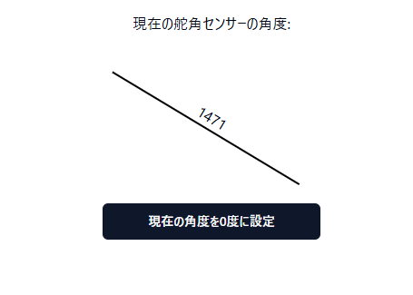
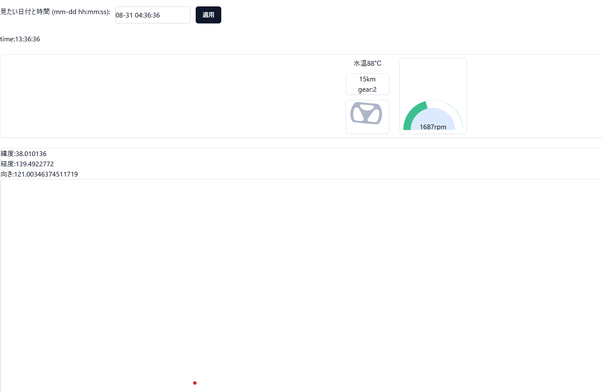

# Data-Logger

NU-25で使用していたデータロガー(インジケーターシステム)です。

## ディレクトリ構造
### circuit
M5Stack内に作ったセンサー系の電気入力をマイコンに接続するための回路図を格納しています。  
もし、現在使用している回路と若干違ってたら申し訳ないです。  
ただ、回路の抵抗値とか使っている部品は同じはず、違ってもルーティングくらいだと思います。  

### m5
M5Stack用のプログラムを格納しています。

### data-logger-front
インジケーターWebアプリと外部監視用のフロントエンドプログラムを格納しています。  

## 機能
### 現状対応しているセンサー

- MoTeCの温度センサー
- ギアポジションセンサー
- 舵角センサー(普通のポテンショメーター)
- MoTeCからのRPM(エンジン回転数)
- M5Stack用6軸IMUユニット

### インジケーター画面

[https://data-logger.vercel.app/indicator/index.html](https://data-logger.vercel.app/indicator/index.html)

connect-bleというボタンを押して、M5StackとBluetooth接続を行います。  
接続が成功すると、センサーの値がリアルタイムで表示されます。  
表示されるセンサーの値はギア、速度(GPSから算出)、RPM、水温です。  

   

### 舵角センサーリセット画面
[https://data-logger.vercel.app/angle/index.html](https://data-logger.vercel.app/angle/index.html)  

舵角センサーは温度や時間経過でドリフトするため、定期的にゼロリセットを行う必要があります。  
そのためのリセット画面がこちらです。  

### センサー情報リアルタイム監視アプリ

[https://data-logger.vercel.app/](https://data-logger.vercel.app/)  

マイコンが繋がるとリアルタイムでセンサー情報が表示されます。  
見れる内容はセンサーの履歴の閲覧と同様なので、そちらを参照してください。  

### センサー情報履歴閲覧アプリ
[https://data-logger.vercel.app/log/](https://data-logger.vercel.app/log/)  

  

過去に収集したセンサーデータの閲覧ができます。  
以下のデータが閲覧できます。  

- 時間
- 水温
- 速度
- ギア
- 舵角
- エンジン回転数
- 緯度、経度
- 向き

### その他

- M5Stack内のSDカードスロットにセンサーデータをCSV形式で保存します。  
(クラウド上に保存されるデータよりも高頻度でデータを保存できます)  

### 動作の様子例

数字がいやに大きいのはデモだと思って気にしないでください。  

<video src="https://github.com/nextfp/wiki/raw/main/indicator/IMG_1897.mov" width="320" height="240" controls></video>

## システム構成図

インジケーターと外部監視用のスマホはどちらもWebアプリという形をとっています。  
M5Stackとインジケーターとして使用するスマホはBluetoothで接続されます。  
スマホとクラウドサーバーはインターネット経由で接続されます。  
