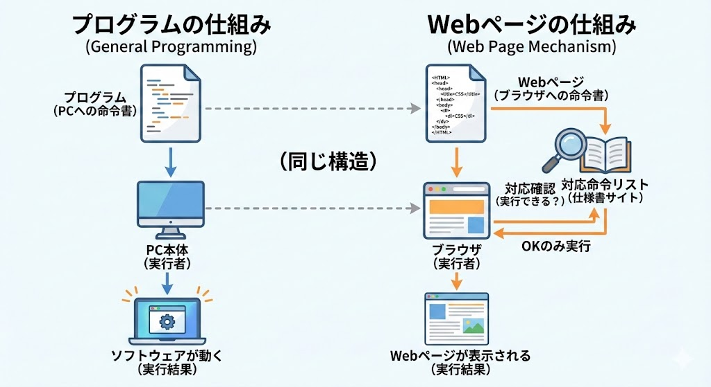

# Bluetoothを選定している理由

## 一番簡単な無線通信方法はWiFiであるという話
M5StackにはデフォルトでWiFiとBluetoothの2つの無線通信モジュールが搭載されています。  
これを利用しない手はありません。  
無線通信を行う方法としては、WiFiが一番簡単です。  
理由としてはIoT的なサービスを構築する際に真っ先に検討される通信方式であり、それ故にこの通信方式を選択する人が多いため使いやすいライブラリが充実しているからです。  

### WiFiとBluetoothの比較
大きく分けると二つの流れがあります。これはBluetoothでも同様です。  

1. WiFiを起動して、接続相手と接続を確立する
2. データ送ったり、データ送信する

1番に関してはWiFIが大幅に優れています。  
WiFiはルーターを介してインターネットに接続することが多いため、接続相手がインターネット上に存在する場合、WiFiを利用することで簡単に接続が確立できます。  
つまりスマホ側のインジケーターWebアプリ側で接続相手との接続を確立するための特別な処理を実装する必要はほぼありません。簡単なのです。  
2番に関してもWiFiは優れています。  
便利すぎてWiFiを使わない理由が見当たらないくらいです。  

## Webアプリについて
今回インジケーターのスマホにセンサーの値を表示するためにWebアプリを利用しています。  

### Webアプリ選定理由

- スマホアプリに比べて開発の手間が低い
- アプリのインストールが不要なので、故障したり充電がなくなっても一瞬で交換できる

### Webアプリとは？
定義がすごいふわふわしていますが、Webページのことです。  
Webサイトと聞くとWikipediaみたいな文字が並んでて動きがあまりないというイメージがありませんか？  
これに対してPCとかでyoutube.comを開くとスマホアプリのYoutubeと同じように使えちゃったりします。こんな感じでスマホアプリみたいなノリで使えちゃう多機能なWebページのことをWebアプリと呼んでいます。厳密な理解ではないですが、この理解で問題ありません。  

### Webページで使える機能
プログラミングをやったことある方ならわかると思いますが、プログラムとは「PCへの命令を書いた文書」です。  
Webページも同様に「ブラウザへの命令を書いた文書」です。  
つまり、ブラウザが対応している命令であれば、Webページ上で実行できることになります。  

このブラウザが対応している命令はこのサイトに書いてあります。  

[https://developer.mozilla.org/ja/docs/Web/API](https://developer.mozilla.org/ja/docs/Web/API)

## 位置情報APIについて
Webページから位置情報を取得するためには位置情報APIを利用します。  
[https://developer.mozilla.org/ja/docs/Web/API/Geolocation_API](https://developer.mozilla.org/ja/docs/Web/API/Geolocation_API)  

位置情報APIはブラウザが対応している命令の一つです。  
位置情報APIを利用することで、Webページからスマホの位置情報を取得できます。  
ところが、位置情報APIはセキュリティ上の理由からHTTPは利用できなくなるという風にブラウザから要求されてしまいます。  
httpsというのはweb上の通信をする方式であるhttpに暗号化の仕組みを追加したものです。 詳しくはAIに聞いてください。  
大事なのはマイコンとの通信はhttpしか使えないということです。  
つまりマイコンと通信すると位置情報APIが使えないというジレンマに陥ります。  

ということで、WiFiを使わずにBluetoothを使うことにしました。  